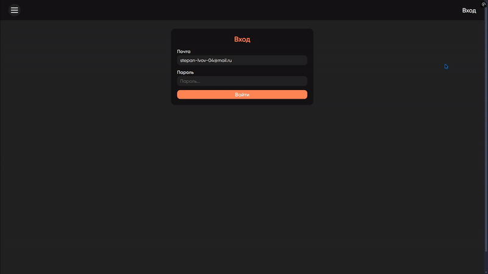
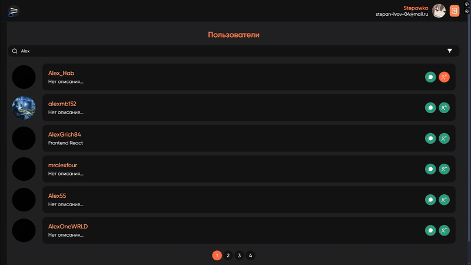
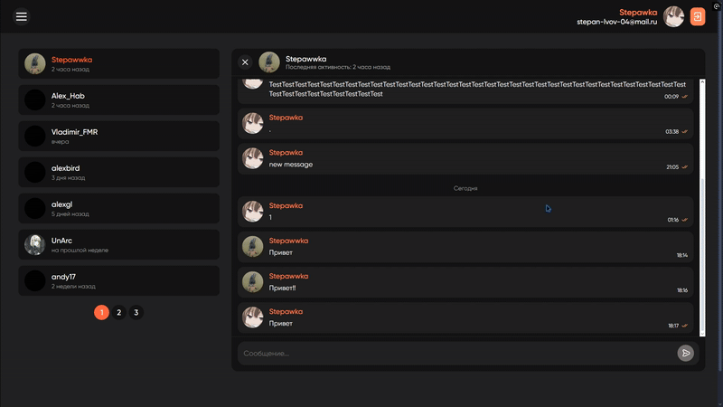

# Messanger

**О проекте:** Проект создан в учебных целях. Приложение представляет собой мессенджер со следующим функционалом:

- **Профиль пользователя**
  - Просмотр информации о других пользователях;
  - Редактирование данных через модальное окно;
  - Редактирование аватара и статуса профиля;
- **Список пользователей**
  - Фильтрация по категориям и поисковой строке (реализована с применением debounce);
  - Возможность подписки/отписки на пользователей;
- **Контекстное меню**
  - Контекстное меню, заменяющее обычное. Может включать в себя любой переданный контент.
  - Автоматическая корректировка позиции в случае нехватки места;
  - Закрывается при клике вне области или отведении курсора на большое расстояние;
- **Диалоги**
  - Обмен сообщениями между пользователями (не в realtime из-за ограничений API);
  - Виртуализация списка сообщений, корректировка скролла;
  - Удаление/восстановление сообщений;
- **Общий чат**
  - Realtime-чат, реализованный через WebSocket;
  - Виртуализация списка сообщений, корректировка скролла;
  - Преобразование URL, email и номеров телефонов в кликабельные ссылки (аналогично и для диалогов);
- **Дополнительно**
  - Смена темы (тёмная/светлая/системная);
  - Адаптивный интерфейс;
  - Toast-уведомления об ошибках;
  - UI-отзывчивость: Индикаторы загрузки для асинхронных действий;
  - Мета-теги для страниц (react-helmet-async)

## Технологии

- CSS3/HTML5
- Typescript
- React
- React Toastify
- React Transition Group
- React linkify it (Форматирование текста)
- Tanstack/React Virtual (Виртуализация)
- React Hook Form
- React Helmer Async
- React Router Dom (v7)
- Redux Toolkit
- Axios
- Vite (Сборщик)
- ESLint (Линтер)

## Использование

### Требования

Для установки и запуска проекта, необходим NodeJS v18+.

### Установка зависимостей

Для установки зависимостей, выполните команду:

```bash
npm i
```

### Запуск Development сервера

Чтобы запустить сервер для разработки, выполните команду:

```
npm start
```

### Сборка проекта

Чтобы собрать проект выполните команду:

```
npm run build
```

## Демонстрация работы

<details>
<summary><b>Развернуть<b></summary></br>

|  |
| :---------------------------------: |
|            _Авторизация_            |

|  |
| :-------------------------------------: |
|         _Профиль пользователя_          |

|  |
| :-------------------------------------: |
|         _Список пользователей_          |

|  |
| :-------------------------------------: |
|                _Диалоги_                |

|  |
| :-----------------------------------------------: |
|      _Контекстное меню (удаление сообщений)_      |

|  |
| :---------------------------------------------: |
|                   _Общий чат_                   |

|  |
| :----------------------------------------------: |
|            _Адаптивность, смена темы_            |

</details>
